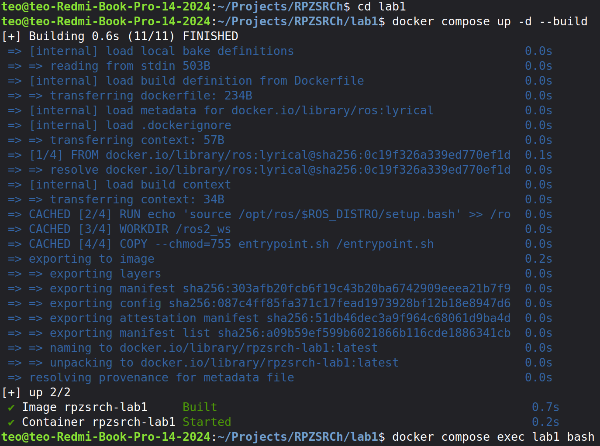
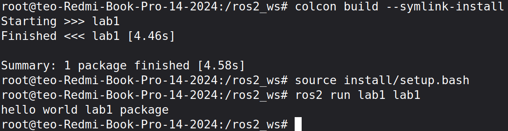
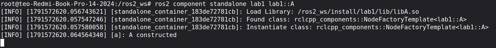
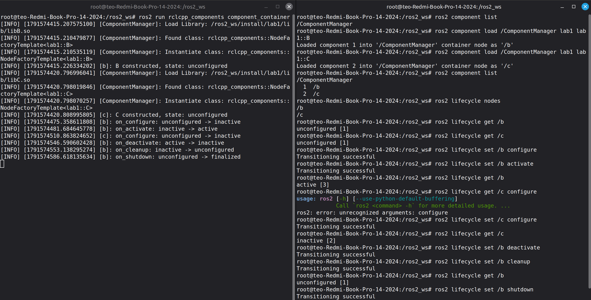

<p align="center"><b>МОНУ НТУУ КПІ ім. Ігоря Сікорського ФПСПМ СПіСКС</b></p>

<p align="center">
<b>Звіт з лабораторної роботи 1</b><br/>
"Вступ до ROS 2, налаштування середовища та розробка вузлів"<br/>
дисципліни "Розробка ПЗ систем реального часу"
</p>

<p align="right"><b>Студент</b>: Козлов Сергій Олександрович група КВ-33</p>
<p align="right"><b>Рік</b>: 2026</p>

## Мета роботи
Опанувати засоби контейнеризації середовища розробки (Docker), навчитися створювати та збирати ROS 2 пакети за допомогою утиліти colcon, проектувати вузли у вигляді компонентів (Components) для роботи у межах єдиного процесу-виконавця (Executor) та реалізовувати вузли з керованим життєвим циклом (Lifecycle Nodes).

## Виконання Роботи

### Середовище розробки

**Середовище:** Docker, образ `ros:lyrical` (ROS 2 Lyrical Luth, Ubuntu 26.04 "resolute")

**Хост:** Linux Mint 22.3 (ядро 7.0.0)

Параметри складання та запуску описані у `compose.yaml`:

```yaml
services:
  lab1:
    build: .
    image: rpzsrch-lab1
    container_name: rpzsrch-lab1
    network_mode: host
    volumes:
      - ./ros2_ws/src:/ros2_ws/src
    working_dir: /ros2_ws
    stdin_open: true
    tty: true
    command: sleep infinity
```

`command: sleep infinity` тримає контейнер активним без основного процесу, що дозволяє під'єднувати до нього кілька терміналів одночасно.

Складання образу та запуск контейнера:

```bash
docker compose up -d --build
```

Вхід у контейнер:

```bash
docker compose exec lab1 bash
```

Зупинка та видалення:

```bash
docker compose down
```

Усередині контейнера:

```bash
colcon build --symlink-install
source install/setup.bash
```

Далі можна працювати з компонентами ROS 2

### 1.1 Налаштування середовища та робочого простору

#### 1. Підготувати Dockerfile на основі офіційного образу ROS 2 та створити скрипт entrypoint.sh для автоматичного сорсингу системного setup.bash.

```docker
# Dockerfile

FROM ros:lyrical

RUN echo 'source /opt/ros/$ROS_DISTRO/setup.bash' >> /root/.bashrc

WORKDIR /ros2_ws

COPY --chmod=755 entrypoint.sh /entrypoint.sh

ENTRYPOINT ["/entrypoint.sh"]

CMD ["bash"]
```

```bash
#entrypoint.sh

#!/bin/bash
set -e

source "/opt/ros/$ROS_DISTRO/setup.bash" --

exec "$@"
```

#### 2. Створити структуру робочої теки ros2_ws/src, ініціалізувати C++ пакет за допомогою розширених команд colcon.

```cpp
// ros2_ws/src/lab1/src/lab1.cpp 

#include <cstdio>
#include "rclcpp/rclcpp.hpp"

int main() {
  printf("hello world lab1 package\n");
}
```

#### 3. Виконати збирання проєкту через colcon build --symlink-install, виконати сорсинг install/setup.bash та перевірити працездатність.





### 1.2 Розробка вузла-компонента (Component Node)

#### 1. Створити C++ клас вузла у власному namespace, успадкований від rclcpp::Node, який приймає конструктор rclcpp::NodeOptions. Сам конструктор можна поки лишити порожнім

#### 2. Зареєструвати вузол як компонент за допомогою макросу RCLCPP_COMPONENTS_REGISTER_NODE.

```cpp
// ros2_ws/src/lab1/src/A.component.cpp 

#include "rclcpp/rclcpp.hpp"
#include "rclcpp_components/register_node_macro.hpp"

namespace lab1
{

class A : public rclcpp::Node
{
public:
  explicit A(const rclcpp::NodeOptions& options)
  : Node("a", options)
  {
    RCLCPP_INFO(get_logger(), "A constructed");
  }
};

}  // namespace lab1

RCLCPP_COMPONENTS_REGISTER_NODE(lab1::A)
```

#### 3. Налаштуйте CMakeLists.txt для збирання спільної бібліотеки з допомогою add_library(ваш_клас SHARED шлях/до_файлу.cpp), пропишіть dependencies та зареєструйте назву через rclcpp_components_register_nodes.

```cmake
cmake_minimum_required(VERSION 3.20)
project(lab1)

if(CMAKE_COMPILER_IS_GNUCXX OR CMAKE_CXX_COMPILER_ID MATCHES "Clang")
  add_compile_options(-Wall -Wextra -Wpedantic)
endif()

find_package(ament_cmake REQUIRED)
find_package(rclcpp REQUIRED)
find_package(rclcpp_components REQUIRED)
find_package(rclcpp_lifecycle REQUIRED)

add_executable(lab1 src/lab1.cpp)
target_compile_features(lab1 PUBLIC c_std_17 cxx_std_20)
target_link_libraries(lab1 ${rclcpp_TARGETS})

install(TARGETS lab1
  DESTINATION lib/${PROJECT_NAME})

foreach(comp A B C)
  add_library(${comp} SHARED src/${comp}.component.cpp)
  target_compile_features(${comp} PUBLIC c_std_17 cxx_std_20)
  target_link_libraries(${comp}
    ${rclcpp_TARGETS}
    ${rclcpp_components_TARGETS}
    ${rclcpp_lifecycle_TARGETS}
  )
  rclcpp_components_register_nodes(${comp} "lab1::${comp}")
endforeach()

install(TARGETS A B C
  ARCHIVE DESTINATION lib
  LIBRARY DESTINATION lib
  RUNTIME DESTINATION bin)

if(BUILD_TESTING)
  find_package(ament_lint_auto REQUIRED)
  set(ament_cmake_copyright_FOUND TRUE)
  set(ament_cmake_cpplint_FOUND TRUE)
  ament_lint_auto_find_test_dependencies()
endif()

ament_package()
```

```xml
<buildtool_depend>ament_cmake</buildtool_depend>

<depend>rclcpp</depend>
<depend>rclcpp_components</depend>
<depend>rclcpp_lifecycle</depend>
```



### 1.3 Розробка керованих вузлів (Lifecycle Nodes) та супервізора

#### 1. Створити два керовані вузли (Managed Nodes), з бібліотеки LifecycleNode.

```cpp
// ros2_ws/src/lab1/src/B.component.cpp

#include "rclcpp/rclcpp.hpp"
#include "rclcpp_lifecycle/lifecycle_node.hpp"
#include "rclcpp_components/register_node_macro.hpp"

namespace lab1
{

class B : public rclcpp_lifecycle::LifecycleNode
{
public:
  using CallbackReturn =
    rclcpp_lifecycle::node_interfaces::LifecycleNodeInterface::CallbackReturn;

  explicit B(const rclcpp::NodeOptions& options)
  : LifecycleNode("b", options)
  {
    RCLCPP_INFO(get_logger(), "B constructed, state: %s",
      get_current_state().label().c_str());
  }

  CallbackReturn on_configure(const rclcpp_lifecycle::State& previous) override
  {
    RCLCPP_INFO(get_logger(), "on_configure: %s -> inactive", previous.label().c_str());
    return CallbackReturn::SUCCESS;
  }

  CallbackReturn on_activate(const rclcpp_lifecycle::State& previous) override
  {
    RCLCPP_INFO(get_logger(), "on_activate: %s -> active", previous.label().c_str());
    return LifecycleNode::on_activate(previous);
  }

  CallbackReturn on_deactivate(const rclcpp_lifecycle::State& previous) override
  {
    RCLCPP_INFO(get_logger(), "on_deactivate: %s -> inactive", previous.label().c_str());
    return LifecycleNode::on_deactivate(previous);
  }

  CallbackReturn on_cleanup(const rclcpp_lifecycle::State& previous) override
  {
    RCLCPP_INFO(get_logger(), "on_cleanup: %s -> unconfigured", previous.label().c_str());
    return CallbackReturn::SUCCESS;
  }

  CallbackReturn on_shutdown(const rclcpp_lifecycle::State& previous) override
  {
    RCLCPP_INFO(get_logger(), "on_shutdown: %s -> finalized", previous.label().c_str());
    return CallbackReturn::SUCCESS;
  }
};

}  // namespace lab1

RCLCPP_COMPONENTS_REGISTER_NODE(lab1::B)
```

```cpp
// ros2_ws/src/lab1/src/B.component.cpp

#include "rclcpp/rclcpp.hpp"
#include "rclcpp_lifecycle/lifecycle_node.hpp"
#include "rclcpp_components/register_node_macro.hpp"

namespace lab1
{

class C : public rclcpp_lifecycle::LifecycleNode
{
public:
  using CallbackReturn =
    rclcpp_lifecycle::node_interfaces::LifecycleNodeInterface::CallbackReturn;

  explicit C(const rclcpp::NodeOptions& options)
  : LifecycleNode("c", options)
  {
    RCLCPP_INFO(get_logger(), "C constructed, state: %s",
      get_current_state().label().c_str());
  }

  CallbackReturn on_configure(const rclcpp_lifecycle::State& previous) override
  {
    RCLCPP_INFO(get_logger(), "on_configure: %s -> inactive", previous.label().c_str());
    return CallbackReturn::SUCCESS;
  }

  CallbackReturn on_activate(const rclcpp_lifecycle::State& previous) override
  {
    RCLCPP_INFO(get_logger(), "on_activate: %s -> active", previous.label().c_str());
    return LifecycleNode::on_activate(previous);
  }

  CallbackReturn on_deactivate(const rclcpp_lifecycle::State& previous) override
  {
    RCLCPP_INFO(get_logger(), "on_deactivate: %s -> inactive", previous.label().c_str());
    return LifecycleNode::on_deactivate(previous);
  }

  CallbackReturn on_cleanup(const rclcpp_lifecycle::State& previous) override
  {
    RCLCPP_INFO(get_logger(), "on_cleanup: %s -> unconfigured", previous.label().c_str());
    return CallbackReturn::SUCCESS;
  }

  CallbackReturn on_shutdown(const rclcpp_lifecycle::State& previous) override
  {
    RCLCPP_INFO(get_logger(), "on_shutdown: %s -> finalized", previous.label().c_str());
    return CallbackReturn::SUCCESS;
  }
};

}  // namespace lab1

RCLCPP_COMPONENTS_REGISTER_NODE(lab1::C)
```

#### 2. Сконфігурувати і активувати ці вузли відповідними командами Transition.



## Висновки

В рамках лабораторної роботи було створено і зібрано новий пакет ROS 2 за допомогою утиліти `colcon`. Було створено і запущено декілька вузлів (Node та LifecycleNode) для перевірки працездатності ROS 2 в середовищі, створеному за допомогою системи контейнеризації Docker. 
